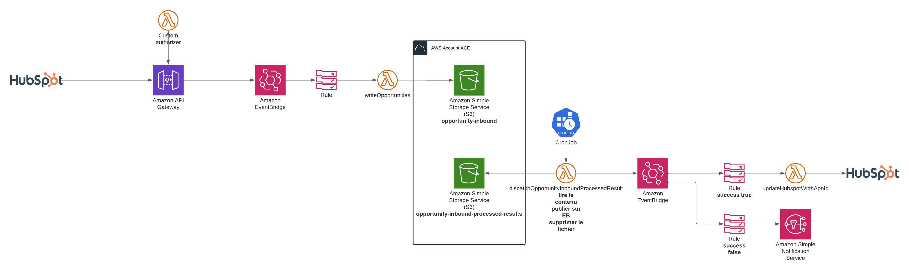

# Hubspot ACE integration

This project aims to connect Theodo's Sales CRM Hubspot to AWS's in order to keep updated leads in both softwares.


_Original diagram is available [here](https://lucid.app/lucidchart/5f2a47fc-9dc0-4e53-9fec-3c0c10c10aa2/edit?page=0_0&invitationId=inv_d0eb3bc1-bcbb-48e0-846f-56d47ad29ffd#)_

# Serverless - AWS Node.js Typescript

This project has been generated using the `aws-nodejs-typescript` template from the [Serverless framework](https://www.serverless.com/).

For detailed instructions, please refer to the [documentation](https://www.serverless.com/framework/docs/providers/aws/).

# Pre-requisite

To contribute and test and deploy your changes you'll need access to :

- Amazon's APN ACE
- Hubspot (Theodo Commercial)
- AWS staging account for the project

## Installation/deployment instructions

Depending on your preferred package manager, follow the instructions below to deploy your project.

> **Requirements**: NodeJS `lts/fermium (v.14.15.0)`. If you're using [nvm](https://github.com/nvm-sh/nvm), run `nvm use` to ensure you're using the same Node version in local and in your lambda's runtime.

### Using NPM

- Run `npm i` to install the project dependencies
- Add AWS programmatic access to your aws credentials file :
  ```
    [ace-integration-staging]
    aws_access_key_id = XXXXXX
    aws_secret_access_key = XXXXXX
  ```
- Add AWS profile definition your aws config file :

  ```
    [profile ace-integration-staging]
    region = eu-west-1
    output = json

    [profile apn-crm-integration-staging-assume-role]
    role_arn = arn:aws:iam::317364603767:role/APN-ACE-Theodo-AccessRole-staging
    source_profile = ace-integration-staging
  ```

- Run `npm run deploy` to deploy this stack to AWS

## Test your service

### Locally

In order to test the hello function locally, run the following command:

- `npx sls invoke local -f hello --path src/functions/hello/mock.json`

Check the [sls invoke local command documentation](https://www.serverless.com/framework/docs/providers/aws/cli-reference/invoke-local/) for more information.

### Remotely

TODO : Update with real request

Copy and replace your `url` - found in Serverless `deploy` command output - and `name` parameter in the following `curl` command in your terminal or in Postman to test your newly deployed application.

```
curl --location --request POST 'https://myApiEndpoint/dev/hello' \
--header 'Content-Type: application/json' \
--data-raw '{
    "name": "Frederic"
}'
```

## Template features

### Project structure

The project code base is mainly located within the `src` folder. This folder is divided in:

- `functions` - containing code base and configuration for your lambda functions
- `libs` - containing shared code base between your lambdas

```
.
├── src
│   ├── functions               # Lambda configuration and source code folder
│   │   ├── hello
│   │   │   ├── handler.ts      # `Hello` lambda source code
│   │   │   ├── index.ts        # `Hello` lambda Serverless configuration
│   │   │   ├── mock.json       # `Hello` lambda input parameter, if any, for local invocation
│   │   │   └── schema.ts       # `Hello` lambda input event JSON-Schema
│   │   │
│   │   └── index.ts            # Import/export of all lambda configurations
│   │
│   └── libs                    # Lambda shared code
│       └── apiGateway.ts       # API Gateway specific helpers
│       └── handlerResolver.ts  # Sharable library for resolving lambda handlers
│       └── lambda.ts           # Lambda middleware
│
├── package.json
├── serverless.ts               # Serverless service file
├── tsconfig.json               # Typescript compiler configuration
├── tsconfig.paths.json         # Typescript paths
└── webpack.config.js           # Webpack configuration
```

### 3rd party libraries

- [json-schema-to-ts](https://github.com/ThomasAribart/json-schema-to-ts) - uses JSON-Schema definitions used by API Gateway for HTTP request validation to statically generate TypeScript types in your lambda's handler code base
- [middy](https://github.com/middyjs/middy) - middleware engine for Node.Js lambda. This template uses [http-json-body-parser](https://github.com/middyjs/middy/tree/master/packages/http-json-body-parser) to convert API Gateway `event.body` property, originally passed as a stringified JSON, to its corresponding parsed object
- [@serverless/typescript](https://github.com/serverless/typescript) - provides up-to-date TypeScript definitions for your `serverless.ts` service file

### Advanced usage

Any tsconfig.json can be used, but if you do, set the environment variable `TS_NODE_CONFIG` for building the application, eg `TS_NODE_CONFIG=./tsconfig.app.json npx serverless webpack`
